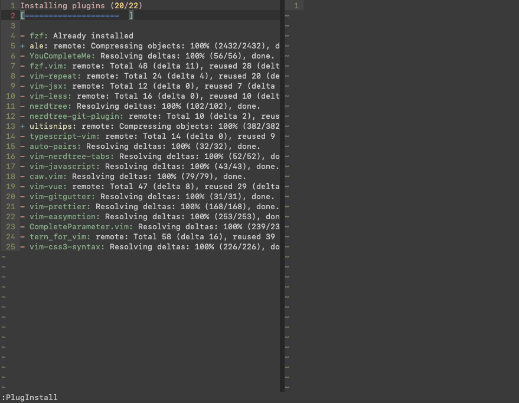
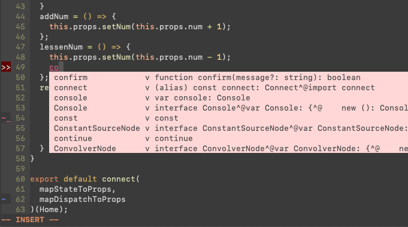
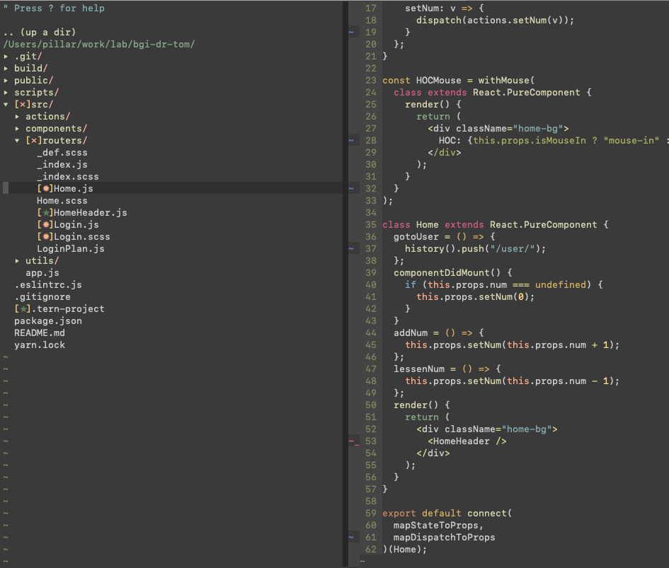
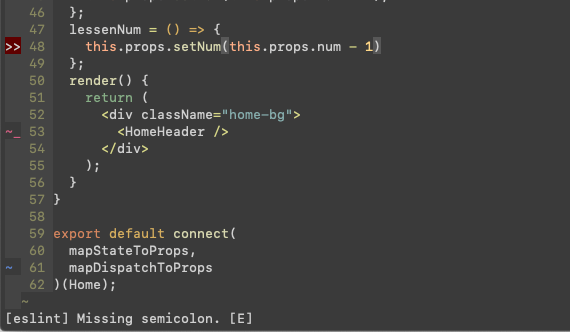
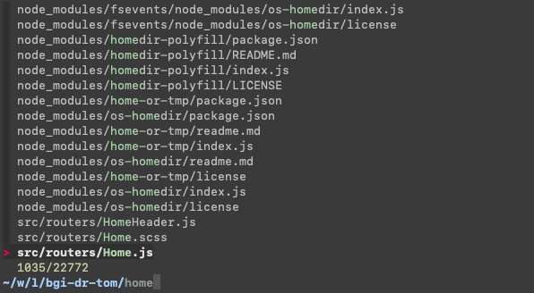
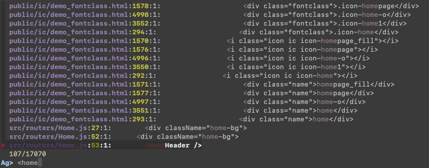
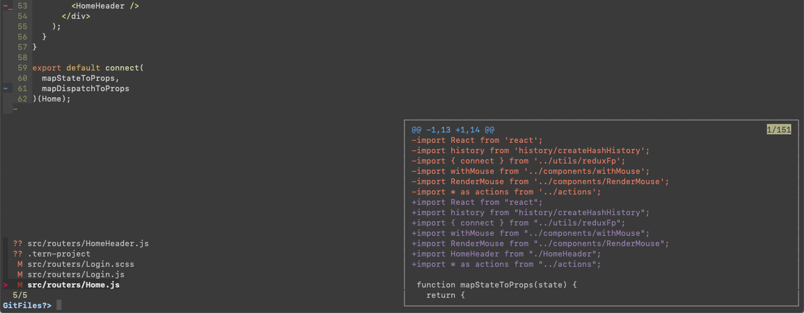
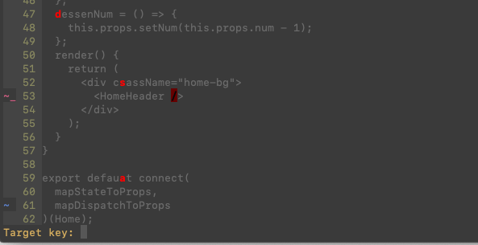

# Front end Vim

> This package testing Mac OS, other System please look and edit `init.sh` and `sectiondInstall.sh`

This VIM config focus Javascript:

- Nodejs
- React
- Vue
- html, js, css

## Install

First, you must isntall `nodejs` and `brew`, and do it:

### 1. Clone and init vim-front-end

```sh
cd ~/
git clone -b master --single-branch https://github.com/ymzuiku/vim-front-end
cd vim-front-end
bash init.sh
```

### 2. Install Plug

```sh
vim
:PlugInstall
```



Waiting all plugin installed.

### 3. Install dependents

```sh
bash secondInstall.sh
```

Use `secondInstall.sh` script install these:

- cmake
- ctags
- Start YouCompleteMe Server
- fzf
- ag
- prettier
- eslint, eslint_d

Wait all dependent installed.

## After installed, let me preview

#### YouCompleteMe:

Use YouCompleteMe and tern_for_vim:



#### Mark git change in tree(hotKey: `so`):



#### ESLint:



#### file Search(hotKey: `fj`):



#### code Search(hotKey: `fa`):



#### Git change files Search(hotKey: `fk`):



#### vim.easymotion (hotKey: `<space>`):



And other feature:

- Use Prettier format
- Use eslint & eslint_d lint
- Use gitgutter show git change in every line
- Other some detile feature look `.vimrc` Plugs

### If mac use vim open file, have this error:

`YouCompleteMe unavailable: cannot import name _remove_dead_weakref`

And close vim, print this:

```
Vim: Caught deadly signal SEGV
Vim: Finished.
```

This error is python path unused system python, need use system python, fix bug like this:

```sh
$ python -V # echo like: Python 2.7.15
$ export PATH=/usr/bin:$PATH
$ python -V # echo like: Python 2.7.10
```

If you need always chagne python PATH, you need `export PATH` in `.bash_profile`

If you didn't want always change PATH, you can add `function` in `.bash_profile`, like this:

```sh
function v(){
  export path=/usr/bin:$path
  vim $1 $2 $3 $4 $5 $6 $7 $8 $9
}
```

Use: `v file.js` open vim

## Diffent Default VIM config:

`s, f, t, q, -, =, <space>` is diffent VIM keys, Please look `.vimrc` file:

- `space = <Leader>`
- `- = <c-b> -flip page up, because tmux uesd <c-b>`
- `= = <c-f> -flip page down`
- `s+v\h\j\k\l\c = <c-w>+v\h\j\k\l\c`
- `sc = :tabnew`
- `sT = :tabo`
- `s[ = last tab`
- `s] = next tab`
- `sb = :!bash open bash, and input exec goback vim`
- `sr = source ~/.vimrc`
- `sa = ggVG -select all line`

- `sm = :Masks -find masks`
- `si = find now file in tree`
- `sI = show files tree`
- `so = hidden/show git and number sign, facility mouse copy multiline`
- `sO = hidden/show hight line`
- `s1~9 = switch tab 1~9`
- `s<space> delete line end space`

- `su hidden/show undo-tree，g-, g= switch undo-tree`
- `fa = :Ag -find code`
- `fj = :Files -find file`
- `fg = :GFiles? -find git change file`
- `fk = :Buffers -change opened buffer`
- `fm = format file`
- `f@ = @:`
- `fs = :w<cr>`
- `fq = :q<cr>`
- `fr = :%s/ -replace`
- `fM = :delm!`
- `f[ = last eslint error line`
- `f] = next eslint error line`

- `<c-j> = move line down`
- `<c-k> = move line up`
- `= = <c-f>
- `- = <c-b>
- `q = vim-easymotion`
- `<tab>` select snippets
- `<cr>` select YouCompleteMe info
- `<c-space>` show YouCompleteMe

- `t = commenter one line`
- `t = commenter multiline in VISUAL Mode`

- `<leader>m = preview markdown`
- `<leader>M = stop preview markdown`

Fast copy and paste:

- `0~9 = "0~9y in VISUAL mode`
- `f0~9 = "0~9p`
- `F0~9 = "0~0P`

These is self hot keys, if you don't like, you can change `.vimrc` easy.

## UltiSnips

Add `javascript.snippets` in `~/.vim/UltiSnips`, can setting snippets

## That's all, enjoy it.

## Licenes

```
MIT License

Copyright (c) 2013-present, Facebook, Inc.

Permission is hereby granted, free of charge, to any person obtaining a copy
of this software and associated documentation files (the "Software"), to deal
in the Software without restriction, including without limitation the rights
to use, copy, modify, merge, publish, distribute, sublicense, and/or sell
copies of the Software, and to permit persons to whom the Software is
furnished to do so, subject to the following conditions:

The above copyright notice and this permission notice shall be included in all
copies or substantial portions of the Software.

THE SOFTWARE IS PROVIDED "AS IS", WITHOUT WARRANTY OF ANY KIND, EXPRESS OR
IMPLIED, INCLUDING BUT NOT LIMITED TO THE WARRANTIES OF MERCHANTABILITY,
FITNESS FOR A PARTICULAR PURPOSE AND NONINFRINGEMENT. IN NO EVENT SHALL THE
AUTHORS OR COPYRIGHT HOLDERS BE LIABLE FOR ANY CLAIM, DAMAGES OR OTHER
LIABILITY, WHETHER IN AN ACTION OF CONTRACT, TORT OR OTHERWISE, ARISING FROM,
OUT OF OR IN CONNECTION WITH THE SOFTWARE OR THE USE OR OTHER DEALINGS IN THE
SOFTWARE.
```
